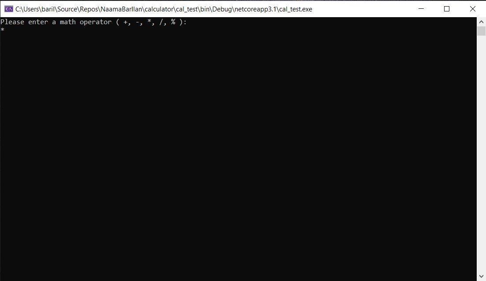

# C# Calculator

*Author: Na'ama Bar-Ilan*

----

## Description

This is a C# console application that asks a user to enter two numbers and a math operator. 
It then performs the calculation and outputs the result to the console.

---

### Getting Started
Clone this repository to your local machine.

```
$ git clone [https://github.com/NaamaBarIlan/calculator.git]

```

### To run the program from Visual Studio:
Select ```File``` -> ```Open``` -> ```Project/Solution```

Next navigate to the location you cloned the Repository.

Double click on the ```calculator``` directory.

Then select and open ```cal_test.sln```

---

### Visuals

#### Application Start

#### Using the Application

#### Application End


---

### Change Log

1.2: *Refactored the method, updates to the notes and README * - 13 Oct 2020  
1.1: *Initial project set up* - 26 Jun 2020  

------------------------------